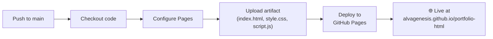

# Publishing to GitHub Pages — Step-by-Step Guide

This document explains every step taken to deploy your **Portfolio-html** project to GitHub Pages.

---

## Prerequisites

Before publishing, you need:
- A **GitHub account** (yours: `alvagenesis`)
- **Git** installed on your machine
- **GitHub CLI (`gh`)** installed and authenticated (optional but makes API calls easier)
- A **repository on GitHub** with your code already pushed (we did this in the prior step)

---

## Step 1: Enable GitHub Pages on the Repository

### What this does
GitHub Pages is a **free static site hosting service** built into GitHub. By default, it's turned off for every repo. We need to tell GitHub: *"Serve this repo as a website."*

### The command
```powershell
gh api repos/alvagenesis/portfolio-html/pages -X POST -f build_type=workflow -f source.branch=main -f source.path=/
```

### Breaking it down

| Part | Meaning |
|------|---------|
| `gh api` | Use the GitHub CLI to make a raw GitHub REST API call |
| `repos/alvagenesis/portfolio-html/pages` | The API endpoint — targets the "Pages" setting for your specific repo |
| `-X POST` | HTTP POST method — we're **creating** the Pages configuration |
| `-f build_type=workflow` | Tells GitHub to deploy using a **GitHub Actions workflow** (modern method) instead of the legacy method |
| `-f source.branch=main` | Deploy from the `main` branch |
| `-f source.path=/` | Serve files from the **root** `/` of the repo (not a subfolder like `/docs`) |

### The response
```json
{
  "html_url": "https://alvagenesis.github.io/portfolio-html/",
  "build_type": "workflow",
  "source": {
    "branch": "main",
    "path": "/"
  },
  "public": true
}
```
This confirms Pages is enabled and your site URL will be `https://alvagenesis.github.io/portfolio-html/`.

> [!TIP]
> **Manual alternative:** You can also do this in the browser by going to **Repository → Settings → Pages → Source → GitHub Actions**.

---

## Step 2: Create the GitHub Actions Workflow File

### What this does
Since we chose `build_type: workflow`, GitHub expects a **GitHub Actions workflow file** that tells it *how* to build and deploy the site. Think of it as an automated recipe that runs every time you push code.

### The file
We created [.github/workflows/static.yml](file:///c:/Users/pao/source/repos/Portfolio-html/.github/workflows/static.yml) — this is a special directory that GitHub watches for workflow definitions.

### Full file with annotations

```yaml
# Human-readable name shown in the Actions tab
name: Deploy to GitHub Pages

# TRIGGER: When does this workflow run?
on:
  push:
    branches: ["main"]    # Runs automatically on every push to 'main'
  workflow_dispatch:       # Also allows manual trigger from the Actions tab

# PERMISSIONS: What is this workflow allowed to do?
permissions:
  contents: read           # Can read your repo files
  pages: write             # Can write to the GitHub Pages service
  id-token: write          # Needed for secure deployment authentication (OIDC)

# CONCURRENCY: Prevent overlapping deployments
concurrency:
  group: "pages"
  cancel-in-progress: false  # Don't cancel a running deploy if a new push happens

# JOBS: The actual work
jobs:
  deploy:
    # Link this job to the 'github-pages' environment (shows in repo settings)
    environment:
      name: github-pages
      url: ${{ steps.deployment.outputs.page_url }}
    runs-on: ubuntu-latest   # Use a Linux virtual machine

    steps:
      # 1. CHECKOUT — Download your repo code onto the runner
      - name: Checkout
        uses: actions/checkout@v4

      # 2. CONFIGURE — Set up GitHub Pages (registers metadata)
      - name: Setup Pages
        uses: actions/configure-pages@v5

      # 3. UPLOAD — Package ALL files in the repo root as a deployable artifact
      - name: Upload artifact
        uses: actions/upload-pages-artifact@v3
        with:
          path: '.'          # Upload everything from the root directory

      # 4. DEPLOY — Publish the artifact to GitHub Pages
      - name: Deploy to GitHub Pages
        id: deployment
        uses: actions/deploy-pages@v4
```

### How the workflow steps connect



---

## Step 3: Commit and Push the Workflow File

### What this does
The workflow file only takes effect once it exists **on GitHub** (not just locally). We need to commit it to git and push it to the remote.

### The commands

```powershell
# Stage the new workflow file for commit
git add .github/workflows/static.yml

# Create a commit with a descriptive message
git commit -m "Add GitHub Pages deployment workflow"

# Push the commit to GitHub (this also triggers the workflow!)
git push
```

### What happens after the push
1. GitHub receives the new commit
2. GitHub detects the workflow file in `.github/workflows/`
3. Since the push was to `main` (matching the trigger), the workflow **automatically starts**
4. A **runner** (Ubuntu VM) spins up, checks out your code, packages it, and deploys it
5. Within ~1-2 minutes, your site is live

---

## Summary of Everything That Happened

| Step | What | Why |
|------|------|-----|
| `git init` | Initialize local git repo | Your project wasn't tracked by git yet |
| `git add -A` | Stage all files | Prepare `index.html`, `style.css`, `script.js` for commit |
| `git commit` | Create initial commit | Save a snapshot of your project |
| `git remote add origin` | Link to GitHub | Tell git where to push |
| `git branch -M main` | Rename branch to `main` | GitHub's default branch name |
| `git push -u origin main` | Push code to GitHub | Upload your code to the remote repo |
| `gh api .../pages -X POST` | Enable GitHub Pages | Turn on the hosting service for this repo |
| Create `static.yml` | Add deployment workflow | Tell GitHub *how* to deploy your static files |
| `git add` + `commit` + `push` | Push the workflow | Trigger the first automated deployment |

---

## Your Live Site

🌐 **https://alvagenesis.github.io/portfolio-html/**

> [!IMPORTANT]
> Every time you push changes to `main`, the workflow will automatically re-deploy your updated site. No manual steps needed after this initial setup!
